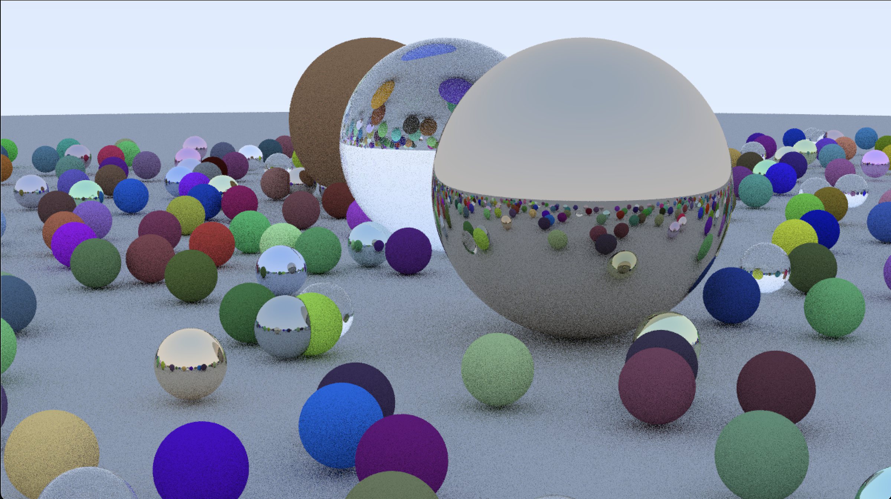

# Ray-Tracer

Creating a Ray Tracker (physics engine) in C++

I want to make this because I love physics and I always wanted to simulate that in code
hdhwuawhkj huadwhiw

Concept:

This is a general Readme file, which will explain the things briefly, if you want a more in-depth documentation on how I made this and what was my thought process behind every step, check out the docs folder

Ray-Tracer v1 is completed (I'll update the docs as well)

This is my final render (10 samples per pixel u can easily get a high resolution image by increasing it)

I'm currently follwing a book called "Ray Tracer in one weekend"
Thank you for reading
