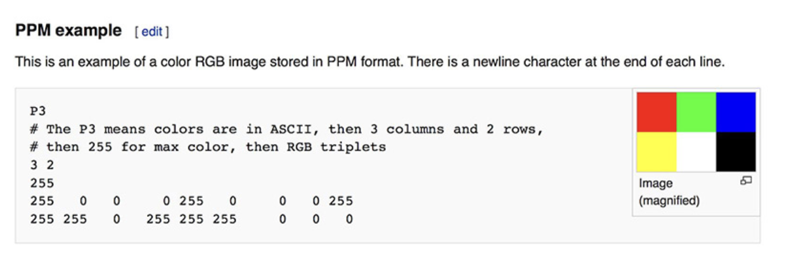

For creating an image file, i'm using ppm format
PPM stands for Portable Pixmap.
It is a very straightforward way of creating an image
Here's a description from wikipedia



So basically what I'm doing is, I'm mapping over some value between 0-255 in a way that ppm understands and creates and image file

In macos, i'm creating a file using the '>' redirection operator

```bash
RayTracker/main > image.ppm
```
